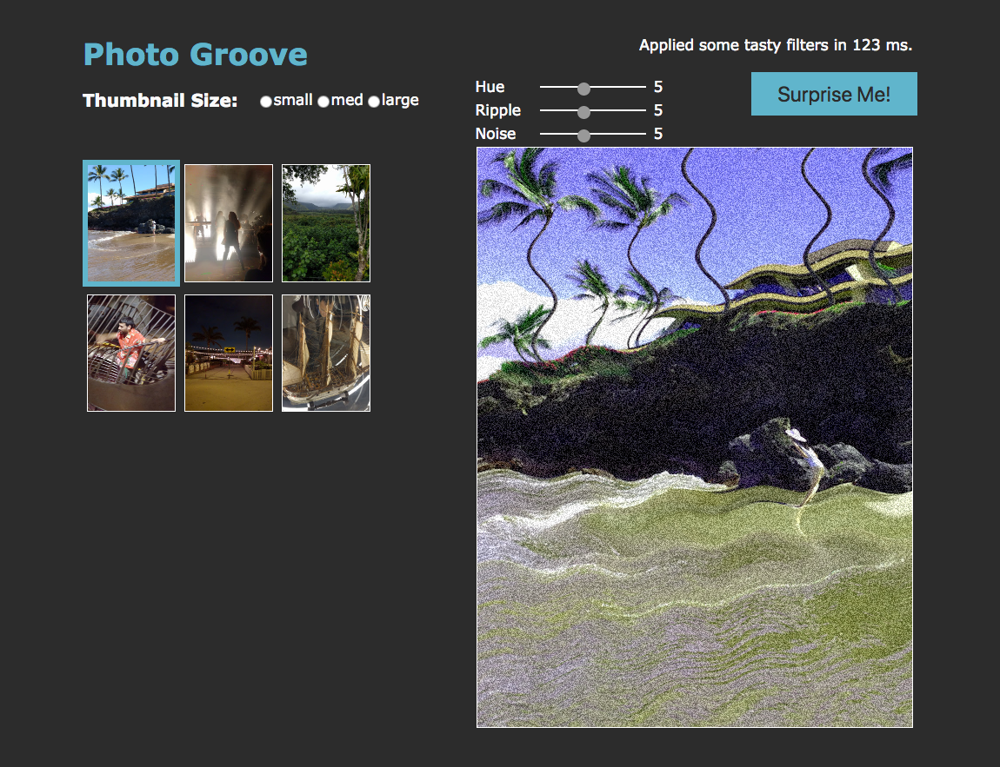

# PhotoGroove

## Table of Contents

* [About](#about)
* [How to run it](#how-to-run-it)
* [How to use it](#how-to-use-it)
* [Dependencies](#dependencies)

## About

The **PhotoGroove** project from **_"Elm in Action"_** is a simple 
photo browsing and editing Web app written in 
**[Elm](https://elm-lang.org)**. The user can select
a specific photo to view it in a larger version and play with the filter
controls to alter the photo.


## How to run it

1) Download or Clone the repository
    
    ```git clone https://github.com/andyfv/elm-photo-groove.git```
    
2) Unzip the file if you have downloaded a ZIP
3) Open the folder containing the project
4) Open ```index.html``` in your browser


## How to use it

This is how the app looks like.



- You can click on any thumbnail on the left of the screen to see 
larger version of it
- Play with the sliders to apply filters (Default settings are at 5)
- Click the ```"Surprise Me!"``` button to randomly select photo


## Dependencies

*None*